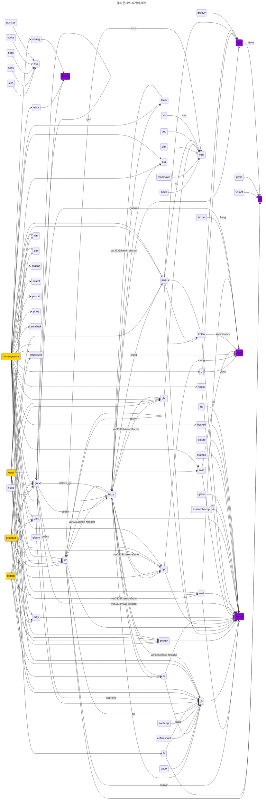

# 놀라운-코드싸개의-세계

일관성을 위해 파생된, 덜 작성하기위해 작성된 모든 성과들을 살펴봅니다.

## Todo

html css wasm llvm asm
검수 및 PR환영

## Mermaid

```mermaid
---
title: 놀라운-코드싸개의-세계
---
stateDiagram
  direction LR

  go --> c#:go2cs
  go --> haxe:go2hx
  neva --> go
  go --> go:gen
  c# --> c#:roslyn
  java --> kotlin
  kotlin --> java

  haxe --> go:reflaxe_go
  haxe --> js
  haxe --> flash
  haxe --> php
  haxe --> cpp
  haxe --> java
  haxe --> jvm
  haxe --> c#
  haxe --> python
  haxe --> lua
  haxe --> cpp:yar3333/haxe-refactor
  haxe --> ts:yar3333/haxe-refactor
  flash --> haxe:yar3333/haxe-refactor
  c# --> haxe:yar3333/haxe-refactor
  ts --> haxe:yar3333/haxe-refactor
  js --> haxe:yar3333/haxe-refactor
  php --> haxe:yar3333/haxe-refactor

  haml --> html
  markdown --> html
  slim --> html
  pug --> html

  php --> html
  java --> html:jsp
  vb --> html:asp
  c# --> html:aspx

  less --> css
  scss --> css
  sass --> css
  stylus --> css
  postcss --> css

  babel --> js
  ts --> js
  coffeescript --> js
  livescript --> js

  c# --> js:h5
  f# --> js:fable
  gleam --> js
  go --> js:gopherjs

  classDef bytecode fill:#8800D6;
  class jvm,il,beam,llvm,wasm bytecode

  java --> jvm
  scala --> jvm
  groovy --> jvm
  kotlin --> jvm

  c# --> il
  f# --> il
  vb.net --> il
  pwsh --> il
  jvm --> il:ikvm

  gleam --> beam
  elixir --> beam
  erlang --> beam

  c --> llvm:clang
  cpp --> llvm:clang
  objectivec --> llvm:clang
  swift --> llvm:sil
  kotlin --> llvm:kotlin/native
  fortran --> llvm:flang
  go --> llvm:gollvm
  rust --> llvm
  
  rust --> wasm
  c# --> wasm:blazor
  js --> wasm
  python --> wasm
  java --> wasm
  php --> wasm
  c# --> wasm
  cpp --> wasm
  ts --> wasm
  ruby --> wasm
  swift --> wasm
  scala --> wasm:jvm
  go --> wasm
  kotlin --> wasm
  rust --> wasm
  dart --> wasm
  assemblyscript --> wasm
  grain --> wasm
  motoko --> wasm
  clojure --> wasm
  haskell --> wasm
  zig --> wasm

  classDef dataformat fill:#FFD600;
  class protobuf,kaitai,bebop,messagepack dataformat

  protobuf --> cpp
  protobuf --> java
  protobuf --> python
  protobuf --> objectivec
  protobuf --> c#
  protobuf --> ruby
  protobuf --> go
  protobuf --> php
  protobuf --> dart
  protobuf --> js

  kaitai --> cpp
  kaitai --> go
  kaitai --> c#
  kaitai --> java
  kaitai --> js
  kaitai --> lua
  kaitai --> nim
  kaitai --> perl
  kaitai --> php
  kaitai --> python
  kaitai --> ruby
  kaitai --> rust
  kaitai --> swift

  bebop --> c#
  bebop --> ts
  bebop --> js
  bebop --> rust
  bebop --> dart
  bebop --> python
  bebop --> cpp
  bebop --> go

  messagepack --> flash
  messagepack --> c
  messagepack --> swift
  messagepack --> objectivec
  messagepack --> c#
  messagepack --> cpp
  messagepack --> dart
  messagepack --> elixir
  messagepack --> erlang
  messagepack --> f#
  messagepack --> go
  messagepack --> haskell
  messagepack --> haxe
  messagepack --> java
  messagepack --> js
  messagepack --> kotlin
  messagepack --> lua
  messagepack --> matlab
  messagepack --> nim
  messagepack --> ocaml
  messagepack --> php
  messagepack --> pascal
  messagepack --> perl
  messagepack --> pony
  messagepack --> python
  messagepack --> ruby
  messagepack --> rust
  messagepack --> scala
  messagepack --> smalltalk
```
